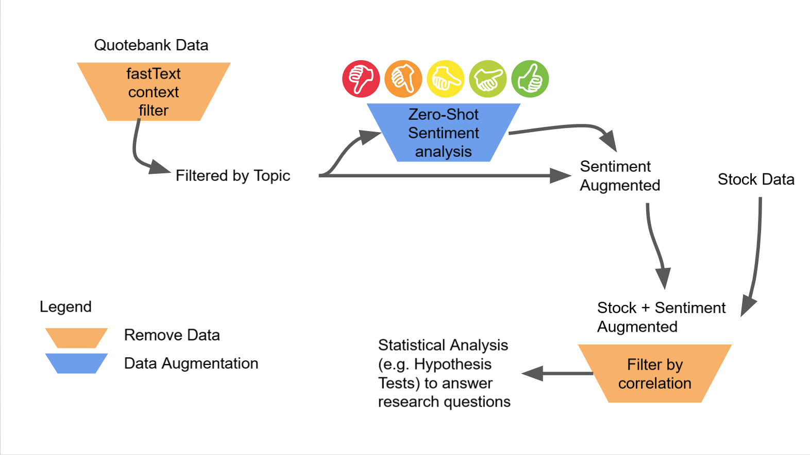

# ADADELTA-Q Project Repository: 'Are random fluctuations of the stock market really random?'
This is the group project repository for the group ADADELTA-Q of the EPFL Applied Data Analysis (2021) course.
## Table of Contents
1. [Abstract](#abstract)
2. [Research Questions](#research-questions)
3. [Proposed Additional Datasets](#proposed-additional-datasets)
4. [Methods](#methods)
5. [Proposed Timeline](#proposed-timeline)
6. [Organization within the Team](#organization-within-team)
7. [Appendix](#appendix)
## Abstract
The goal of this project is to construct a pipeline that allows to identify those individuals whose quotes have an impact on the stock market and its fluctuations. We use the [Quotebank](https://zenodo.org/record/4277311#.YX0LcpuxW0o) dataset as it includes a large amount of quotations from different sources since 2015. We filter these quotes to retain only quotations related to the stock market. Then, we classify the sentiment of each quote as either positive, neutral, or negative, and we study whether for each individual these sentiments are correlated with a sudden change in the US stock market.

## Research Questions
According to the Efficient Market Hypothesis, asset prices reflect the value of the given assets given all the information available at a certain moment in time. Therefore, new information is expected to lead to changes in prices and more assets being traded. Even less informative news by influential people might change the expectation of investors and lead to change in prices. Who has this influence on the market? This is the main research goal of this project, which we want to study by studying the following research questions:
1. To what extent do published quotations impact the stock market? 
2. After how long can we notice the effect of the quotations?
3. Which are the people that have affected it the most? Are they always the same?
4. Considering only the most influential individual, do impactful quotations differ at the morphological or syntactical level to those less influential?

We acknowledge that some questions are harder to answer given the characteristics of the data. In particular, the main challenge will be isolating the effect of a quotation on the stock market in order to avoid spurious effects. For this reason, we believe questions 1 and 2 will be more challegning to answer.

## Data

### Quotebank
From [Quotebank](https://zenodo.org/record/4277311#.YX0LcpuxW0o), we only consider the years from 2015 until 2020. 

### Stock Data

We will make use of the SPY(S&P500) dataset from 2015 until 2020 that can be retrieved from the yahoofinance library. We employ the S&P500 index since it is often used as a proxy for the general market trend. We will perform the analysis using both the daily closing value of the index ("Close") as well as the traded volume ("Volume"). The latter is employed to account for the fact that certain events (e.g. published quotations) might have opposite effects on different stocks included in the index leading to a zero-net change in the index value, instead we would detect a spike on the volume traded.

#### Preprocessing
The [EDA](https://github.com/epfl-ada/ada-2021-project-adadelta-q/blob/icapado-patch-1/S%26P500_analysis.ipynb) revealed multiple missing values corresponding to festivities or weekend days, as expected. We will deal with this challenge in two ways and then compare the conclusions:
- We consider only the very short-term effect that a quotation might have on the market and thus we discard all the events happening during the weekend because such short term effect would not be detected.
- We consider a longer-term effects (the market might take some time to adjust) and in this case we do consider the events happening during the weekend and thus we interpolate the S&P500 values. This second approach might be more challenging because the larger the time-span considered, the harder it is to isolate the relation between the quotation and the market since other events could happen in between.

## Methodology
The pipeline of the methods can be summarized as follows:
### Topic Filtering
The selection of the quotes that are relevant to the topic of financial markets is done using vector representations of words, in particular we employ [fastText](https://fasttext.cc/) , a state-of-the-art model for text representations. 
We tokenize the data and convert to lower case, removing any english stopwords. 
We then train the model using the standard unsupervised fastText. This way, each quote is transformed into a set of word embeddings. We define a set of keywords that we consider representative of the topic we are analyzing, i.e.`[market, stocks, trade, bonds, obligations]` and compute the mean vector representation of each word. We then compare the embedding of each word in a quote to the computed key word vector and choose the closest distance as representative value for similarity of the whole quote. We filter quotes by some threshold of similarity to reduce data.

### Sentiment Classification
To perform this step we considered three possible options: unsupervised methods, pre-trained BERT, or transfer learning. 

#### Pre-trained BERT
Since Quotebank has been developed using BERT, this model was our first choice. The pre-trained BERT was not able to correctly detect the polarities of two simple artificial sentences, which shows the need of fine-tuning the model for our task. Since we do not have labeled data, we looked into unsurpassed methods. 

#### Unsupervised methods
The fastest and easiest to implement method was VADER from the NLTK library. An experiment done with 1000 quotations showed us that a large percentage of times the vader model simply classified a quotation as neutral even if the sentiment was clearly more radical. 

#### Transfer Learning 
Lately, "Zero-Shot NLP models" have been popularized, which are pre-trained models able to perform well on unseen and unlabeled data without needing fine-tuning. 
The models available in the Transformers' library are trained using the Natural Language Inference (NLI) approach. Using the same 1000 quotations [we used for testing](https://github.com/epfl-ada/ada-2021-project-adadelta-q/blob/Luca/sentiment_analysis.ipynb) VADER and using the default model roberta-large-mnli, we found a more intuitive and reasonable classification of the sentences' polarities. We will thus use this method to classify all the quotations. 
The running time will be significant, but feasible.

### Correlation analysis
Once the market-related quotes are selected and classified according to their sentiment, we combine this data with the stock market data described above. We plan on doing this in two steps:
1. We compare the correlation between single speakers and the stock market
2. Among the speakers which do have a correlation, we want to move from correlation more to causation, i.e. those that show the strongest relations. 

We plan on utilizing granger causality and hypothesis testing.

*Some feedback/input on this point from the TA is highly appreciated!*

## Proposed Timeline

We propose the following timeline (numbers refer to list [here](#organization-within-team)): 
- [x] P1 (Individual):
   - [x] Idea 1
   - [x] Idea 2
   - [x] Idea 3
- [x] P2:
  - [x] 1., 2. fully and 3. partially implemented
  - [x] Feasibility analysis of 4.-7.
  - [x] README.md
  - [x] Notebook
- [ ] P3:
   - [ ] Updated Readme
   - [ ] Updated Notebook
   - [ ] Data Story
Should be confirmed with [webiste](https://dlab.epfl.ch/teaching/fall2021/cs401/projects/) before each deadline.
## Organization within Team

1. [Filter Quotebank data](./preprocess.py) using a semantic filter to obtain a subset of topic relevant data.:
   - [x] Identify most suitable (pretrained) filter (fasttext)
   - [x] Apply filter
   - [ ] Fine-Tune Hyperparameters (e.g. cutoff values) to get reasonably sized data
2. Process data so that quotes can easily be matched to speakers
   - [x] Remove irrelevant data (could also be done in 1. -> has been done in 1)
   - [x] Group by speakers 
3. Apply a sentiment classifier with respect to a topic
   - [x] Identify suitable (pretrained on news data) sentiment filter (fasttext/BERT/Zero-shot)
   - [x] Apply
   - [x] Fine-tune
4. Merge topic speakers with time-series of topic data (e.g. S&P500)
   - [x] Identify what stock/index we want
   - [ ] Specification of what data format we need (Granularity, Fields)
   - [x] Identify suitable Data source (e.g [Yahoo finance](https://pypi.org/project/yfinance/) / [SimFin](https://github.com/SimFin/simfin) ) 
   - [ ] Obtain (API Keys?) Data
   - [ ] Preprocess stock  (remove irrelevant fields, ensure easy format for merging)
   - [ ] Merge data
5. Filter speakers that have low/now correlation with topic data
   - [ ] Identify how, e.g. [Granger Causailty](https://en.wikipedia.org/wiki/Granger_causality)
6. Compare speakers with each other
7. Filter speakers that are *'shadowing'* other speakers.
8. Review
   - [ ] Critically identify biases and other issues with our pipeline
   - [ ] Fix what can be fixed in the time given 
   - [ ] [Report any issues related to Quotebank](https://docs.google.com/forms/d/e/1FAIpQLSfe14V9gKV3chVSC7_Y_mTIJz_YcvgbIaxGSESmH1kS9RbcZA/viewform)
   - [ ] Final Notebook
   - [ ] Datastory


## Appendix

### Repository Structure
```
ada-2021-project-adadelta-q
│   README.md
│   filtering.py    # filtering script to process entire dataset
│   filtering_tests.ipynb    # some basic tests on filtering
│   sentiment_analyisis.ipynb # Sentiment analiysis tetss
│   S\&P500_analysis.ipynb # Stock data trials
└───data  # store data here (will be ignored by git)
│   
└───src    # for supporting code
```
### Downloading Data
On any linux system with wget:
```
cd data
wget -i downloadables.txt 
```
will download all Quotebank data from 2015 to 2020.

### Environment
To setup, run:
```
conda create --name <env> --file requirements.txt
```

